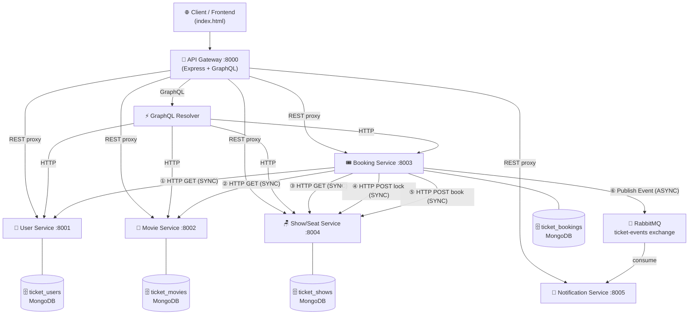

# 🎬 CineBook — Microservices Movie Ticket Booking System
### College Practical-6 | Mobile Application Programming (MAP)

---

## 📋 Problem Statement

Design and implement a **microservices-based movie ticket booking system** that demonstrates:
- Multi-microservice architecture with independent services
- **Synchronous** service-to-service communication (HTTP/REST)
- **Asynchronous** service-to-service communication (RabbitMQ)
- API Gateway as the single external entry point
- GraphQL for aggregated data queries
- Seat locking for concurrency control
- Reliability patterns: timeout, retry, error handling

---

## 🏗️ Architecture



---

## 🗂️ Project Structure

```
ticket-booking-microservices/
│
├── api-gateway/              ← :8000 — External entry point
│   ├── src/
│   │   ├── graphql/
│   │   │   └── schema.js    ← GraphQL typedefs + resolvers
│   │   └── server.js        ← Express + Apollo + proxy
│   └── package.json
│
├── user-service/             ← :8001 — User management
│   ├── src/
│   │   ├── models/User.js
│   │   ├── routes/userRoutes.js
│   │   ├── controllers/userController.js
│   │   └── server.js
│   └── package.json
│
├── movie-service/            ← :8002 — Movie catalog
│   ├── src/
│   │   ├── models/Movie.js
│   │   ├── routes/movieRoutes.js
│   │   ├── controllers/movieController.js
│   │   └── server.js
│   └── package.json
│
├── booking-service/          ← :8003 — Core booking logic
│   ├── src/
│   │   ├── models/Booking.js
│   │   ├── routes/bookingRoutes.js
│   │   ├── controllers/bookingController.js
│   │   ├── services/httpClient.js  ← timeout + retry
│   │   ├── rabbitmq/publisher.js   ← RabbitMQ publisher
│   │   └── server.js
│   └── package.json
│
├── show-seat-service/        ← :8004 — Shows + seat locking
│   ├── src/
│   │   ├── models/Show.js
│   │   ├── routes/showRoutes.js
│   │   ├── controllers/showController.js
│   │   └── server.js
│   └── package.json
│
├── notification-service/     ← :8005 — Async event consumer
│   ├── src/
│   │   ├── rabbitmq/consumer.js    ← RabbitMQ consumer
│   │   └── server.js
│   └── package.json
│
├── frontend/                 ← Static dashboard
│   ├── index.html
│   ├── css/style.css
│   └── js/app.js
│
├── docker-compose.yml
├── .env.example
├── package.json
└── README.md
```

---

## 🛠️ Technology Stack

| Layer                  | Technology                               |
|------------------------|------------------------------------------|
| Backend Runtime        | Node.js 18 + Express.js                  |
| API Gateway            | Express + `http-proxy-middleware`         |
| Synchronous Comm.      | REST / HTTP (axios)                       |
| Asynchronous Comm.     | RabbitMQ (`amqplib`)                      |
| GraphQL                | Apollo Server v4 + GraphQL               |
| Database               | MongoDB (Mongoose ODM)                   |
| Frontend               | HTML + CSS + Vanilla JS                   |
| Containerization       | Docker + Docker Compose                   |

---

## ⚙️ Prerequisites

- **Node.js** v18+
- **MongoDB** (local or Docker)
- **RabbitMQ** (local or Docker)
- **npm** v8+

---

## 🚀 How to Run

### Option A: Local (Without Docker)

**Step 1 — Install MongoDB and RabbitMQ**
```bash
# MongoDB: https://www.mongodb.com/try/download/community
# RabbitMQ: https://www.rabbitmq.com/download.html
# Or run just the infrastructure via Docker:
docker run -d -p 27017:27017 --name mongodb mongo:6.0
docker run -d -p 5672:5672 -p 15672:15672 --name rabbitmq rabbitmq:3-management
```

**Step 2 — Install dependencies for all services**
```powershell
# Run each in separate PowerShell windows, or run sequentially:
Set-Location user-service;        npm install
Set-Location ../movie-service;    npm install
Set-Location ../show-seat-service; npm install
Set-Location ../booking-service;  npm install
Set-Location ../notification-service; npm install
Set-Location ../api-gateway;      npm install
```

**Step 3 — Start each service in a SEPARATE terminal window**

```powershell
# Terminal 1 — User Service
cd user-service; node src/server.js

# Terminal 2 — Movie Service
cd movie-service; node src/server.js

# Terminal 3 — Show/Seat Service
cd show-seat-service; node src/server.js

# Terminal 4 — Booking Service
cd booking-service; node src/server.js

# Terminal 5 — Notification Service
cd notification-service; node src/server.js

# Terminal 6 — API Gateway (start last)
cd api-gateway; node src/server.js
```

**Step 4 — Open Frontend**
Open `frontend/index.html` in a browser (just double-click it).

---

### Option B: Docker Compose

```bash
docker-compose up --build
```

This starts:
- MongoDB on port 27017
- RabbitMQ on ports 5672 (AMQP) + 15672 (Management UI)
- All 6 microservices
- API Gateway on port 8000

---

## 🌐 Service Ports Summary

| Service              | Port  | URL                              |
|----------------------|-------|----------------------------------|
| API Gateway          | 8000  | http://localhost:8000            |
| User Service         | 8001  | http://localhost:8001            |
| Movie Service        | 8002  | http://localhost:8002            |
| Booking Service      | 8003  | http://localhost:8003            |
| Show/Seat Service    | 8004  | http://localhost:8004            |
| Notification Service | 8005  | http://localhost:8005            |
| GraphQL Playground   | 8000  | http://localhost:8000/graphql    |
| RabbitMQ Management  | 15672 | http://localhost:15672           |

---

## 📡 REST API Reference

### Via API Gateway (use these in Postman)

#### Users
```
GET    http://localhost:8000/api/users
GET    http://localhost:8000/api/users/:id
POST   http://localhost:8000/api/users
POST   http://localhost:8000/api/users/login
```

**POST /api/users** — Create user
```json
{
  "name": "John Doe",
  "email": "john@example.com",
  "password": "password123"
}
```

**POST /api/users/login**
```json
{
  "email": "alice@example.com",
  "password": "password123"
}
```

#### Movies
```
GET    http://localhost:8000/api/movies
GET    http://localhost:8000/api/movies/:id
POST   http://localhost:8000/api/movies
PUT    http://localhost:8000/api/movies/:id
DELETE http://localhost:8000/api/movies/:id
```

#### Shows
```
GET    http://localhost:8000/api/shows
GET    http://localhost:8000/api/shows/:id
GET    http://localhost:8000/api/shows/:id/seats
POST   http://localhost:8000/api/shows
POST   http://localhost:8000/api/shows/:id/lock-seats
POST   http://localhost:8000/api/shows/:id/release-seats
POST   http://localhost:8000/api/shows/:id/book-seats
```

#### Bookings
```
GET    http://localhost:8000/api/bookings
GET    http://localhost:8000/api/bookings/:id
GET    http://localhost:8000/api/bookings/user/:userId
POST   http://localhost:8000/api/bookings
POST   http://localhost:8000/api/bookings/:id/cancel
```

**POST /api/bookings** — Create booking (triggers full synchronous flow)
```json
{
  "userId": "<user_id>",
  "movieId": "<movie_id>",
  "showId": "<show_id>",
  "seats": ["A1", "A2"]
}
```

#### Notifications
```
GET    http://localhost:8000/api/notifications
```

---

## ⚡ GraphQL Queries

Access GraphQL at: `http://localhost:8000/graphql`

### 1. Get All Movies
```graphql
query {
  movies {
    id
    title
    genre
    language
    duration
    rating
  }
}
```

### 2. Movie with Shows and Available Seats
```graphql
query {
  movie(id: "PASTE_MOVIE_ID_HERE") {
    title
    genre
    language
    shows {
      id
      theatreName
      date
      time
      availableSeats {
        seatNumber
        price
      }
    }
  }
}
```

### 3. Booking with User + Movie (aggregated from 3 services)
```graphql
query {
  booking(id: "PASTE_BOOKING_ID_HERE") {
    id
    status
    seats
    totalAmount
    createdAt
    user {
      name
      email
    }
    movie {
      title
      genre
    }
  }
}
```

### 4. All Bookings for a User
```graphql
query {
  userBookings(userId: "PASTE_USER_ID_HERE") {
    id
    status
    seats
    totalAmount
  }
}
```

---

## 🔄 Communication Flows

### Synchronous Communication (HTTP/REST)
When a booking is created, the Booking Service makes these HTTP calls IN SEQUENCE:

```
[BOOKING SERVICE] Creating booking...
[BOOKING SERVICE] → Calling User Service...        (GET /users/:id)
[USER SERVICE]    ✓ User found → Alice Johnson
[BOOKING SERVICE] → Calling Movie Service...       (GET /movies/:id)
[MOVIE SERVICE]   ✓ Movie found → Inception
[BOOKING SERVICE] → Calling Show/Seat Service...   (GET /shows/:id)
[SHOW/SEAT SERVICE] ✓ Show found → PVR Cinemas
[BOOKING SERVICE] → Requesting seat lock...        (POST /shows/:id/lock-seats)
[SHOW/SEAT SERVICE] ✓ Seats A1,A2 LOCKED
[BOOKING SERVICE] → Confirming seats as booked...  (POST /shows/:id/book-seats)
[SHOW/SEAT SERVICE] ✓ Seats A1,A2 BOOKED
[BOOKING SERVICE] ✓ Booking CONFIRMED
```

### Asynchronous Communication (RabbitMQ)
After booking confirmation, the event flows:

```
[BOOKING SERVICE] → RabbitMQ (publish BOOKING_CONFIRMED)
     ↓
[RABBITMQ] Exchange: ticket-events | Routing key: booking.confirmed
     ↓
[NOTIFICATION SERVICE] ← Consumes from queue: notification-queue
     ↓
╔══════════════════════════════════════════╗
║ NOTIFICATION SERVICE                     ║
║ ✔ BOOKING CONFIRMATION                   ║
║ Booking ID: 6xx...                       ║
║ Movie: Inception                         ║
║ Seats: A1, A2                            ║
║ Amount: ₹600                             ║
╚══════════════════════════════════════════╝
```

---

## 🪑 Seat Locking

The system prevents two users from booking the same seat:

| State       | Description                              |
|-------------|------------------------------------------|
| AVAILABLE   | Can be selected and locked               |
| LOCKED      | Reserved temporarily (max 2 minutes)     |
| BOOKED      | Permanently reserved                     |

**Flow:** `AVAILABLE → LOCKED → BOOKED`

If two requests try to lock the same seat simultaneously, the second gets:
```json
{
  "success": false,
  "message": "Seats not available: A1 (LOCKED)"
}
```

LOCKED seats automatically revert to AVAILABLE after **2 minutes** if not confirmed.

---

## ⚠️ Reliability Features

| Feature        | Implementation                                             |
|----------------|-------------------------------------------------------------|
| Timeout        | 5 second timeout on all inter-service HTTP calls            |
| Retry          | Up to 2 retries on safe GET operations (not mutations)      |
| Error handling | Structured errors with HTTP status codes                    |
| RabbitMQ reconnect | Automatic reconnect with 5s delay on disconnect        |
| Durable queues | Messages survive RabbitMQ restarts                         |
| Seat locking   | Prevents duplicate bookings for same seat                   |

---

## 🧪 End-to-End Test (Postman)

1. **GET** `http://localhost:8000/api/users` — Copy a user ID
2. **GET** `http://localhost:8000/api/movies` — Copy a movie ID
3. **GET** `http://localhost:8000/api/shows` — Copy a show ID
4. **GET** `http://localhost:8000/api/shows/{showId}/seats` — See available seats
5. **POST** `http://localhost:8000/api/bookings`:
   ```json
   { "userId": "...", "movieId": "...", "showId": "...", "seats": ["A1","A2"] }
   ```
6. Watch terminal logs — see synchronous calls!
7. **GET** `http://localhost:8000/api/notifications` — See async notification!
8. Use GraphQL to retrieve the booking with aggregated user + movie info.

---

## ❌ Failure Testing

### Test 1: Service Unavailable
1. Stop Movie Service (close its terminal)
2. Try to create a booking
3. Expected: `{ "success": false, "message": "Movie Service is unavailable" }`

### Test 2: Duplicate Seat Booking
1. Book seat A1 with User A (confirmed)
2. Try to book A1 with User B
3. Expected: `{ "success": false, "message": "Seats not available: A1 (BOOKED)" }`

### Test 3: RabbitMQ Message Durability
1. Stop Notification Service
2. Create a booking (RabbitMQ stores the message)
3. Restart Notification Service
4. Watch it consume the pending message from the queue!

---

## 🗄️ Database Design

| Database        | Service              | Collections  |
|-----------------|----------------------|--------------|
| ticket_users    | User Service         | users        |
| ticket_movies   | Movie Service        | movies       |
| ticket_shows    | Show/Seat Service    | shows        |
| ticket_bookings | Booking Service      | bookings     |

Each service **owns its own database**. Cross-service data access happens only via REST APIs.

---

## 🐰 RabbitMQ Architecture

| Component       | Value              |
|-----------------|--------------------|
| Exchange        | ticket-events      |
| Exchange Type   | Topic              |
| Queue           | notification-queue |
| Routing Keys    | booking.confirmed, booking.cancelled |
| Durability      | Durable exchange + durable queue + persistent messages |

---

## 📝 Seed Data

On first startup, services automatically seed:
- **3 Users**: Alice Johnson, Bob Smith, Charlie Brown (password: `password123`)
- **5 Movies**: Inception, Interstellar, Avengers: Endgame, Dune, The Dark Knight
- **3 Shows**: PVR Mumbai, INOX Delhi, Cinepolis Bangalore (20 seats each)
